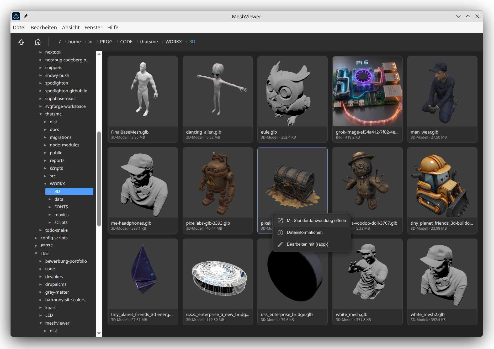

# Meshviewer

Electron application that renders local `*.glb` files as thumbnails (three.js, GLTFLoader). It also support SVG and most common pixel formats.

]


## Install

Currently there are only Linux AppImage builds, but the app runs on any OS.

## Running from sources

```bash
pnpm install
pnpm start
```

Navigate in the directory tree on the left (rooted at `/`); `..` goes one level up, the Home button jumps to the user directory. All found GLB files (including subfolders) are rendered as previews, image files are shown directly. Clicking a tile opens the large view in full window size (3D models can be rotated and zoomed with the mouse); "Back" or `ESC` returns to the list view.

## Supported Formats

- **3D models**: `*.glb` (GLTF Binary), rendered with three.js/GLTFLoader
- **Images**: `*.png`, `*.jpg`, `*.jpeg`, `*.gif`, `*.webp`, `*.avif`, `*.bmp`, `*.svg`, `*.ico`

Image formats are decoded directly by the Chromium/Electron image decoder; additional formats (e.g. HEIC/HEIF or JPEG XL) are not supported by Electron on Linux/Windows.

## Localization

The UI is English by default; German is provided as a translation via i18next. The language follows the system locale (`app.getLocale()`). Pull requests for new translations are welcome.

## Structure

- `src/main.js` – Main process: custom protocol `app://`, filesystem IPC, CSP header
- `src/preload.js` – secure API bridge (`contextBridge`)
- `src/renderer/` – UI with three.js thumbnail rendering
